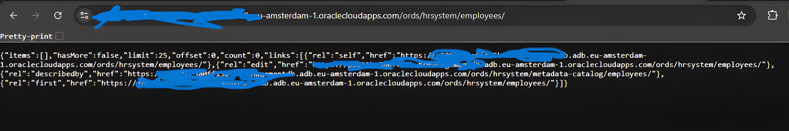

## Project Overview

The Client required a lightweight Oracle Cloud Infrastructure (OCI) environment for application development and testing. The setup needed a managed database with REST API access and a small compute instance for hosting services, all within Oracle’s Always Free tier for cost optimization.

This project focuses on correct resource provisioning, standard security controls, and clean documentation rather than overengineering.

---

## Deliverables

- Oracle Autonomous Database with REST-enabled endpoints
- OCI Compute Instance (E2.1.Micro) running Ubuntu 24.04
- Secure network configuration using OCI Security Lists

---

## Database Setup

- **Service:** Oracle Autonomous Database (Using Transaction Processing)
- **Tier:** Always Free
- **Access Method:** Oracle APEX + ORDS (AutoREST)

A simple relational table was created and exposed as a REST API using Oracle APEX AutoREST functionality.

 *(Database details page)*

---

 *(APEX showing REST-enabled object)*

---

## REST API

The database exposes standard CRUD operations through Oracle REST Data Services.

Supported operations:
- GET all records
- GET record by ID
- POST new record
- PUT update record
- DELETE record

*(JSON response from REST API in browser)*

---

## Compute Instance

- **Shape:** VM.Standard.E2.1.Micro
- **Operating System:** Ubuntu 24.04 LTS
- **Authentication:** SSH key-based login
- **Purpose:** Application hosting / API consumer

The instance was deployed into a preconfigured network and inherits security rules defined at the subnet level.

 *(Compute instance in a running state)*

---

## Security Controls

Security was applied at the cloud networking layer:

- Ingress restricted to required ports only (SSH, HTTP, HTTPS)
- SSH access limited to trusted IP
- No unnecessary services exposed
- Outbound traffic allowed for updates and external access

These controls ensure the instance is usable while remaining minimally exposed.

 *(Security List ingress rules)*

---

## Project Outcome

- Functional OCI environment deployed using Always Free resources
- Managed database successfully exposed via REST API
- Compute instance provisioned and secured

This setup reflects a realistic client requirement for a small backend environment rather than a lab-only exercise.

---

## Technologies Used

- Oracle Cloud Infrastructure (OCI)
- Oracle Autonomous Database
- Oracle APEX
- Oracle REST Data Services (ORDS)
- Ubuntu 24.04 LTS
- SQL

---

## Author

Victor Ojeje  
GitHub: https://github.com/escanut  
Email: [ojejevictor@gmail.com](mailto:ojejevictor@gmail.com)

